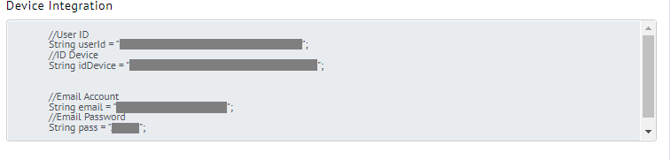
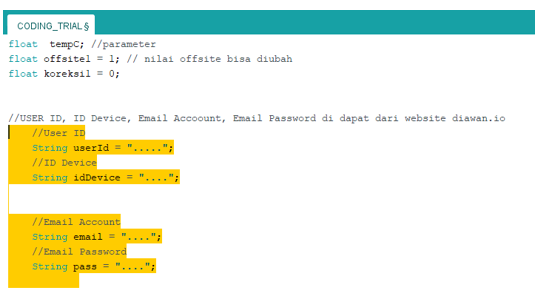

<a name="readme-top"></a>
<div align="center">
  <a href="https://github.com/github_username/repo_name">
    
  </a>
  </div>
  <h3 align="center">For Your Solution IoT Platform</h3>
  <br>
  
<!-- ABOUT THE PROJECT -->
## About Diawan.io


Diawan merupakan penyedia layanan penyedia platform IoT yang diinisiasi pada tahun 2020, diawan merupakan anak perusahaan dari ELIT, perusahaan yang bergerak di bidang pengembangan software.<br>
Dengan diawan, Pengguna dapat dengan bebas memproses data pengukuran dari perangkat, pengguna dapat melakukan skema kontrol, pengguna juga dapat memvisualisasikan data dengan banyak pilihan model tampilan, dan pengguna bebas melaporkan data dengan berbagai periode waktu. Diawan juga memiliki fitur Notifikasi WhatsApp yang dapat memudahkan pengguna dan masih banyak lainnya.
Anda dapat mengunjungi situsnya di https://diawan.io

## Features Of Diawan.io

- [ ] Monitoring
- [ ] Controlling
- [ ] Reporting
- [ ] Realtime 
- [ ] WhatsApp Notification
<br>


# CARA MENGHUBUNGKAN PERANGKAT KE DIAWAN.IO
1. Download Source Code Library untuk Koneksikan Device ke Diawan.io
   ```
   https://diawan.io/file-dokumentasi/DOKUMENTASI.zip
   ```
   Download Library Diawan <br>
      ```
   https://github.com/sayadiawan/DiawanLibraries
   ```
2. Letakkan file library di direktori `libraries` dalam file instalasi Arduiono
3. Ambil identitas perangkat Anda di situs web diawan.io, login dan kunjungi 
    ```
   IOT Management > Device Management > klik AKSI dibagian device > Connect Device
   ```
   <div align="Left"><a href="https://github.com/github_username/repo_name"></a></div>
4. Salin Identitas Perangkat lalu letakkan di bagian sumber kode berikut <br><div align="Left"><a href="https://github.com/github_username/repo_name"></a></div>
5. Jalankan file Arduino
6. Setelah berhasil, sambungkan ke wifi Device IoT Anda
7. Kemudian hubungkan wifi lokal Anda
8. Setelah itu buka website diawan dan pergi ke halaman `live show device`. untuk membuka `live show device` kamu harus `login` dan kunjungi <br>

   ```
   IOT Management > Device Management > klik AKSI dibagian device > Live Action Device
   ```
9. Jika Anda melihat perubahan nilai sensor, perangkat Anda telah berhasil tersambung


<p align="right">(<a href="#readme-top">Kembali ke Awal</a>)</p>

<br>
<br>

## PENJELASAN SOURCE KODE ARDUINO UNTUK KONEKSIKAN DEVICE KE DIAWAN
* Source kode berikut adalah library yang di perlukan
   ```
        #include <Arduino.h>
        #include <WiFiManager.h>
        #include <Wire.h>
        #include <ESP8266WiFi.h>
        #include "diawan.h"
        #include <FS.h>
        #include "SparkFunHTU21D.h"
   ```
* Berikut Source Kode untuk menginisialisasikan parameter yang anda gunakan, sebagai contoh saya menggunakan parameter `tempC` dan `humidity`
Anda bisa menambah atau mengurangi parameter sesuai yang anda inginkan.

   ```
      String link;
      float tempC, humidity;
      int restart, reset;
   ```
* Bagian Source code diatas adalah bagian inisialisasi akun diawan anda yang telah di jelaskan di bagian cara Koneksikan Device

  ```
      //USER ID, ID Device, Email Accoount, Email Password di dapat dari website diawan.io
      String userId = "--------------------------";
      //ID Device
      String idDevice = "------------------------";

      //Email Account
      String email = "-------------";
      //Email Password
      String pass = "--------";
  ```
* Bagian Script Kode diatas merupakan class yang berisi atribut atribut dari sebuah parameter yang ada di file `diawan.h`

   ```
        Parameter *parameter;
   ```
* Source Kode diatas bagian untuk koneksikan Wifi

    ```
        void setup() {

          //Koneksikan Wifi
          wifiManager.setConfigPortalTimeout(300);
          if (wifiManager.autoConnect(node_ID)) {
            Serial.print("IP address: ");
            Serial.println(WiFi.localIP());
            delay(1000);
          }
    ```
* Pada bagian atas isikan nilai pada setiap parameter, Setelah mengisi nilai sensor, lalu memasang nilai hasil sensor ke variable parameter. Jumlah variable tergantung jumlah parameter yang digunakan.

    ```
        tempC =  // isi nilai sensor
        humidity =  //isi nilai sensor

        parameter[0].setValue(tempC);
        parameter[1].setValue(humidity);
    ```
    <details>
  <summary>NOTE</summary>
     Urutan parameter disesuaikan dengan urutan yang ada di connect device diawan
 * Source Kode diatas bagian Restart dan Reset
Untuk memastikan apakah device sudah terhubung diawan, anda bisa cek di diawan.io dihalaman Live Device
    ```
        //mengecek jika nilai restart 1 device akan merestart, jika 0 tidak melakukan apa-apa
        if(restart==1){
          ESP.restart();
        }

        //mengecek jika nilai reset 1 device akan mereset wifi, jika 0 tidak melakukan apa-apa
        if(reset==1){
          wifiManager.resetSettings();
          ESP.restart();
        }

    ```


<p align="right">(<a href="#readme-top">Kembali ke Awal</a>)</p>

### PENJELASAN FUNGSI PARAMETER
Fungsi parameter berisi atribut atribut yang ada di file `diawan.h` seperti :
```
      float _offsite ; 
      float _min ; 
      float _max ; 
      float _correction ;
```
Anda bisa memanggil atribut tersebut dengan cara mengetikkan kode berikut :
```
        float offsitetemperature=parameter[0].getOffsite();
        float mintemperature=parameter[0].getMin();
        float maxtemperature=parameter[0].getMax();
        float correctiontemperature=parameter[0].getCorrection();
```
Letakkkan kode diatas di bagian setelah bagian untuk melakukan push atau sebelum bagian restart Wifi

  <p align="right">(<a href="#readme-top">Kembali ke Awal</a>)</p>

